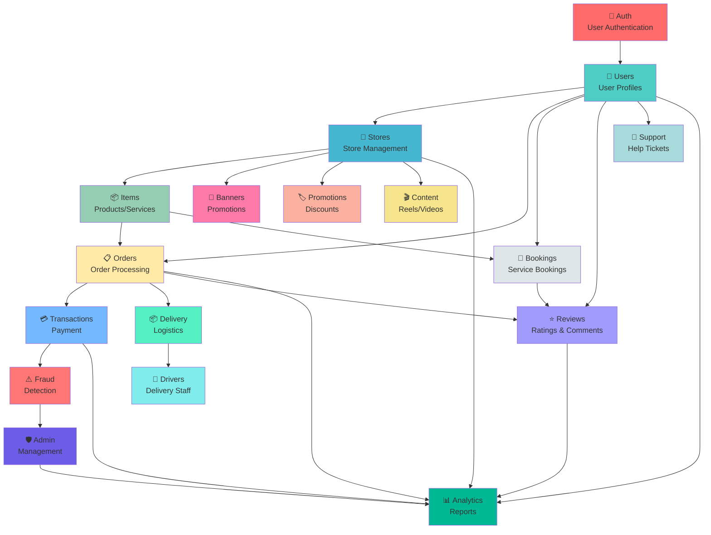

# 🏛️ DIAGRAMME DE CLASSE UML - PLATEFORME SaaS MARKETPLACE

## Architecture Complète - Tous les Modèles & Fonctionnalités

```mermaid
classDiagram
    %% ==================== AUTHENTIFICATION ====================
    class User {
        -id: UUID
        -email: String
        -password_hash: String
        -email_verified: DateTime
        -created_at: DateTime
        -updated_at: DateTime
        +register()
        +login()
        +verify_email()
        +reset_password()
    }
    
    class UserProfile {
        -id: UUID
        -user_id: FK
        -full_name: String
        -phone: String
        -role: Enum[ADMIN, BUSINESS_OWNER, PRO, CLIENT]
        -avatar_url: String
        -status: Enum[active, suspended, banned]
        -latitude: Float
        -longitude: Float
        -city: String
        -address: String
        -created_at: DateTime
        -updated_at: DateTime
        +update_profile()
        +get_location()
        +suspend_account()
        +activate_account()
    }
    
    %% ==================== MAGASINS & STORES ====================
    class Store {
        -id: BigInt
        -owner_id: FK
        -name: String
        -slug: String
        -description: String
        -category: Enum[RESTAURANT, SHOP, SERVICE, OTHER]
        -phone: String
        -email: String
        -website: String
        -address: String
        -latitude: Float
        -longitude: Float
        -city: String
        -logo_url: String
        -banner_url: String
        -status: Enum[PENDING, VERIFIED, REJECTED, SUSPENDED]
        -rating_average: Float
        -total_reviews: Int
        -total_orders: Int
        -view_count: Int
        -opening_hours: JSON
        -gallery: JSON
        -created_at: DateTime
        -verified_at: DateTime
        +create_store()
        +update_store()
        +verify_store()
        +get_analytics()
        +list_products()
        +calculate_rating()
    }
    
    class StoreVerification {
        -id: BigInt
        -store_id: FK
        -business_license_url: String
        -id_card_url: String
        -business_registration: String
        -rne: String
        -verification_notes: String
        -verified_by: FK
        -verified_at: DateTime
        +verify_store()
        +reject_verification()
        +request_more_info()
    }
    
    class BusinessDirectory {
        -id: BigInt
        -store_id: FK
        -title: String
        -totalScore: Float
        -reviewsCount: Int
        -street: String
        -city: String
        -country: String
        -website: String
        -phone: String
        -place_id: String
        -latitude: Float
        -longitude: Float
        -is_claimed: Boolean
        -claimed_by: FK
        -data_source: String
        -verified: Boolean
        -opening_hours: JSON
        +claim_listing()
        +update_from_source()
        +sync_with_store()
    }
    
    class ServiceDirectory {
        -service_id: BigInt
        -owner_id: FK
        -name: String
        -slug: String
        -description: String
        -category: String
        -phone: String
        -address: String
        -city: String
        -latitude: Float
        -longitude: Float
        -status: Enum[ACTIVE, INACTIVE]
        -rating_average: Float
        -total_reviews: Int
        -opening_hours: JSON
        +register_service()
        +update_service()
        +get_schedule()
    }
    
    %% ==================== PRODUITS & SERVICES ====================
    class Item {
        -id: BigInt
        -store_id: FK
        -item_type: Enum[PRODUCT, SERVICE]
        -name: String
        -slug: String
        -description: String
        -price: Decimal
        -price_unit: Enum[unit, hour, day, session]
        -stock_quantity: Int
        -duration_minutes: Int
        -is_bookable: Boolean
        -status: Enum[AVAILABLE, HIDDEN, FLAGGED, BANNED]
        -main_image: String
        -image_2: String
        -image_3: String
        -view_count: Int
        -order_count: Int
        -booking_count: Int
        -rating_average: Float
        -total_reviews: Int
        -embedding: Vector
        -created_at: DateTime
        +create_item()
        +update_item()
        +get_rating()
        +check_availability()
        +get_recommendations()
    }
    
    class ServiceSchedule {
        -id: BigInt
        -item_id: FK
        -day_of_week: Int
        -start_time: Time
        -end_time: Time
        -max_bookings: Int
        -is_active: Boolean
        +add_schedule()
        +update_schedule()
        +get_available_slots()
        +is_available_at()
    }
    
    %% ==================== COMMANDES & TRANSACTIONS ====================
    class Order {
        -id: BigInt
        -order_number: String
        -customer_id: FK
        -store_id: FK
        -item_id: FK
        -quantity: Int
        -unit_price: Decimal
        -total_price: Decimal
        -status: Enum[PENDING, CONFIRMED, SHIPPED, DELIVERED, CANCELLED]
        -payment_method: String
        -delivery_address: String
        -delivery_latitude: Float
        -delivery_longitude: Float
        -notes: String
        -created_at: DateTime
        -updated_at: DateTime
        +create_order()
        +confirm_order()
        +ship_order()
        +deliver_order()
        +cancel_order()
        +get_status()
    }
    
    class Transaction {
        -id: BigInt
        -order_id: FK
        -customer_id: FK
        -store_id: FK
        -amount: Decimal
        -currency: String
        -payment_method: String
        -status: Enum[PENDING, SUCCESS, FAILED, REFUNDED]
        -transaction_id: String
        -payment_proof: String
        -created_at: DateTime
        -processed_at: DateTime
        +create_transaction()
        +process_payment()
        +refund_payment()
        +verify_payment()
    }
    
    class Booking {
        -id: BigInt
        -booking_number: String
        -customer_id: FK
        -item_id: FK
        -store_id: FK
        -service_schedule_id: FK
        -booking_date: DateTime
        -duration_minutes: Int
        -status: Enum[PENDING, CONFIRMED, COMPLETED, CANCELLED]
        -notes: String
        -created_at: DateTime
        +create_booking()
        +confirm_booking()
        +complete_booking()
        +cancel_booking()
        +send_reminder()
    }
    
    %% ==================== AVIS & ÉVALUATIONS ====================
    class Review {
        -id: BigInt
        -reviewer_id: FK
        -store_id: FK
        -item_id: FK
        -order_id: FK
        -rating: Int
        -title: String
        -comment: String
        -sentiment: Enum[POSITIVE, NEUTRAL, NEGATIVE]
        -helpful_count: Int
        -unhelpful_count: Int
        -verified_purchase: Boolean
        -images: Array
        -response: String
        -response_at: DateTime
        -created_at: DateTime
        -updated_at: DateTime
        +create_review()
        +update_review()
        +respond_to_review()
        +analyze_sentiment()
        +mark_helpful()
        +flag_inappropriate()
    }
    
    %% ==================== PROMOTIONS & BANNIÈRES ====================
    class Banner {
        -id: BigInt
        -store_id: FK
        -title: String
        -subtitle: String
        -description: String
        -image_url: String
        -cta_text: String
        -cta_url: String
        -banner_type: String
        -placement: String
        -start_date: DateTime
        -end_date: DateTime
        -is_active: Boolean
        -view_count: Int
        -click_count: Int
        -created_at: DateTime
        +create_banner()
        +update_banner()
        +track_view()
        +track_click()
        +get_ctr()
    }
    
    class Promotion {
        -id: BigInt
        -store_id: FK
        -code: String
        -description: String
        -discount_type: Enum[PERCENTAGE, FIXED_AMOUNT, FREE_SHIPPING]
        -discount_value: Decimal
        -min_order_amount: Decimal
        -max_discount: Decimal
        -usage_limit: Int
        -usage_count: Int
        -start_date: DateTime
        -end_date: DateTime
        -is_active: Boolean
        -applicable_items: Array
        -created_at: DateTime
        +create_promotion()
        +validate_promotion()
        +apply_promotion()
        +get_applicable_items()
        +deactivate_promotion()
    }
    
    %% ==================== LIVRAISON & LOGISTIQUE ====================
    class Driver {
        -id: BigInt
        -user_id: FK
        -store_id: FK
        -first_name: String
        -last_name: String
        -phone: String
        -vehicle_type: String
        -license_number: String
        -status: Enum[ACTIVE, INACTIVE, SUSPENDED]
        -rating_average: Float
        -total_deliveries: Int
        -current_latitude: Float
        -current_longitude: Float
        -is_online: Boolean
        -created_at: DateTime
        +register_driver()
        +update_status()
        +accept_delivery()
        +start_delivery()
        +complete_delivery()
        +update_location()
        +get_active_deliveries()
    }
    
    class Delivery {
        -id: BigInt
        -order_id: FK
        -driver_id: FK
        -store_id: FK
        -delivery_address: String
        -delivery_latitude: Float
        -delivery_longitude: Float
        -start_latitude: Float
        -start_longitude: Float
        -status: Enum[PENDING, ASSIGNED, IN_TRANSIT, DELIVERED, FAILED]
        -estimated_time: Int
        -actual_time: Int
        -notes: String
        -proof_of_delivery: String
        -created_at: DateTime
        +assign_driver()
        +start_delivery()
        +update_delivery_status()
        +calculate_eta()
        +mark_delivered()
    }
    
    %% ==================== FRAUDE & SÉCURITÉ ====================
    class FraudAlert {
        -id: BigInt
        -user_id: FK
        -store_id: FK
        -order_id: FK
        -alert_type: String
        -score: Float
        -reason: String
        -evidence: JSON
        -status: Enum[PENDING, INVESTIGATING, CONFIRMED, FALSE_POSITIVE]
        -action_taken: String
        -created_at: DateTime
        -resolved_at: DateTime
        +create_alert()
        +investigate_alert()
        +confirm_fraud()
        +take_action()
        +mark_false_positive()
    }
    
    class FraudScore {
        -id: BigInt
        -user_id: FK
        -transaction_id: FK
        -score: Float
        -risk_level: Enum[LOW, MEDIUM, HIGH, CRITICAL]
        -factors: JSON
        -models_used: Array
        -created_at: DateTime
        +calculate_score()
        +get_risk_level()
        +get_contributing_factors()
    }
    
    %% ==================== CONTENUS & RÉELS ====================
    class Reel {
        -id: BigInt
        -store_id: FK
        -content_type: Enum[VIDEO, CAROUSEL, STORY]
        -title: String
        -description: String
        -media_urls: Array
        -duration: Int
        -thumbnail_url: String
        -status: Enum[DRAFT, PUBLISHED, ARCHIVED, FLAGGED]
        -view_count: Int
        -like_count: Int
        -share_count: Int
        -comment_count: Int
        -created_at: DateTime
        -updated_at: DateTime
        +create_reel()
        +publish_reel()
        +get_engagement()
        +recommend_to_users()
    }
    
    class UserInteraction {
        -id: BigInt
        -user_id: FK
        -reel_id: FK
        -interaction_type: Enum[view, like, click, contact]
        -created_at: DateTime
        +log_interaction()
        +get_user_history()
    }
    
    %% ==================== PRÉFÉRENCES & PERSONNALISATION ====================
    class UserPreference {
        -id: BigInt
        -user_id: FK
        -category: String
        -score: Float
        +update_preference()
        +calculate_recommendations()
    }
    
    class SavedPlace {
        -id: BigInt
        -user_id: FK
        -store_id: FK
        -created_at: DateTime
        +save_place()
        +unsave_place()
        +get_saved_places()
    }
    
    %% ==================== SUPPORT CLIENT ====================
    class SupportTicket {
        -id: BigInt
        -user_id: FK
        -store_id: FK
        -order_id: FK
        -subject: String
        -description: String
        -category: String
        -priority: Enum[LOW, MEDIUM, HIGH, CRITICAL]
        -status: Enum[OPEN, IN_PROGRESS, RESOLVED, CLOSED]
        -assigned_to: FK
        -created_at: DateTime
        -resolved_at: DateTime
        +create_ticket()
        +assign_ticket()
        +add_response()
        +resolve_ticket()
        +reopen_ticket()
    }
    
    class TicketResponse {
        -id: BigInt
        -ticket_id: FK
        -respondent_id: FK
        -message: String
        -attachments: Array
        -created_at: DateTime
        +add_response()
        +delete_response()
    }
    
    %% ==================== ADMINISTRATION ====================
    class AdminUser {
        -id: BigInt
        -user_id: FK
        -role: Enum[SUPER_ADMIN, MODERATOR, ANALYST]
        -permissions: Array
        -created_at: DateTime
        +grant_permission()
        +revoke_permission()
        +audit_action()
    }
    
    class AuditLog {
        -id: BigInt
        -admin_id: FK
        -entity_type: String
        -entity_id: BigInt
        -action: String
        -changes: JSON
        -timestamp: DateTime
        +log_action()
        +get_audit_trail()
    }
    
    %% ==================== ANALYTICS ====================
    class Analytics {
        -id: BigInt
        -date: DateTime
        -metric_type: String
        -value: Float
        -dimensions: JSON
        +record_metric()
        +get_metrics()
        +generate_report()
    }
    
    class DashboardMetrics {
        -total_users: Int
        -total_stores: Int
        -total_orders: Int
        -total_revenue: Decimal
        -fraud_alerts: Int
        -avg_rating: Float
        +get_kpis()
        +get_trends()
    }
    
    %% ==================== RELATIONS ====================
    User "1" --> "1" UserProfile
    User "1" --> "*" Store
    User "1" --> "*" Order
    User "1" --> "*" Booking
    User "1" --> "*" Review
    User "1" --> "*" FraudAlert
    User "1" --> "*" SavedPlace
    User "1" --> "*" UserPreference
    User "1" --> "*" UserInteraction
    User "1" --> "*" SupportTicket
    User "1" --> "*" Driver
    
    Store "1" --> "*" Item
    Store "1" --> "*" Order
    Store "1" --> "*" Booking
    Store "1" --> "*" Review
    Store "1" --> "*" Banner
    Store "1" --> "*" Promotion
    Store "1" --> "*" Reel
    Store "1" --> "*" Delivery
    Store "1" --> "1" StoreVerification
    Store "1" --> "1" BusinessDirectory
    
    Item "1" --> "*" Order
    Item "1" --> "*" Booking
    Item "1" --> "*" Review
    Item "1" --> "*" ServiceSchedule
    
    Order "1" --> "1" Transaction
    Order "1" --> "1" Delivery
    Order "1" --> "*" Review
    
    Booking "1" --> "1" ServiceSchedule
    Booking "1" --> "*" Review
    
    Driver "1" --> "*" Delivery
    
    Reel "1" --> "*" UserInteraction
    
    Review "1" --> "*" UserInteraction
    
    SupportTicket "1" --> "*" TicketResponse
```



---

## 📋 Tableau des Classes & Responsabilités

| Classe | Module | Responsabilités |
|---|---|---|
| **User** | auth | Authentication, login, registration |
| **UserProfile** | users | User profile management, roles, status |
| **Store** | stores | Store management, verification, analytics |
| **Item** | items | Products/Services catalog, pricing |
| **Order** | orders | Order processing, status tracking |
| **Booking** | bookings | Service booking management |
| **Transaction** | transactions | Payment processing, refunds |
| **Review** | reviews | Customer reviews, ratings, sentiment |
| **Banner** | banners | Promotional banners, tracking |
| **Promotion** | promotions | Discounts, promo codes |
| **Driver** | drivers | Delivery personnel management |
| **Delivery** | deliveries | Logistics tracking |
| **FraudAlert** | fraud | Fraud detection & alerts |
| **Reel** | content | Video content management |
| **SupportTicket** | support | Customer support tickets |
| **AdminUser** | admin | Admin roles & permissions |
| **Analytics** | analytics | Metrics & reporting |

---

## 🔄 Flux de Données Principaux

### 1. Flux Commande Produit
```
User (Client)
    ↓
Browse Items (Store → Item)
    ↓
Create Order
    ↓
Payment (Transaction)
    ↓
Order Status Update
    ↓
Delivery (Driver → Delivery)
    ↓
Delivery Complete
    ↓
Review Creation (Review)
```

### 2. Flux Réservation Service
```
User (Client)
    ↓
View Service (Item + ServiceSchedule)
    ↓
Create Booking
    ↓
Booking Confirmation
    ↓
Service Delivery
    ↓
Review Creation
```

### 3. Flux Vérification Fraude
```
Transaction Created
    ↓
Calculate FraudScore
    ↓
If Score > Threshold:
    ├─ Create FraudAlert
    ├─ Investigate (AdminUser)
    ├─ Take Action
    └─ Log to AuditLog
```

### 4. Flux Admin/Modération
```
Admin (AdminUser)
    ↓
Monitor Metrics (DashboardMetrics)
    ↓
Review Fraud Alerts (FraudAlert)
    ↓
Verify Stores (StoreVerification)
    ↓
Review Reports (Analytics)
    ↓
Take Actions (AuditLog)
```

---

## 🔐 Contrôle d'Accès par Rôle

```
┌─────────────────────────────────────────────────────┐
│ CLIENT                                              │
├─────────────────────────────────────────────────────┤
│ • Browse stores & items                             │
│ • Create orders & bookings                          │
│ • Pay for transactions                              │
│ • Leave reviews                                      │
│ • Track order/delivery status                       │
│ • Contact support                                    │
│ • Save favorite places                              │
└─────────────────────────────────────────────────────┘

┌─────────────────────────────────────────────────────┐
│ BUSINESS_OWNER                                      │
├─────────────────────────────────────────────────────┤
│ • Manage store profile                              │
│ • Create items (products/services)                  │
│ • View orders & bookings                            │
│ • Respond to reviews                                │
│ • Create promotions & banners                       │
│ • View analytics & revenue                          │
│ • Manage drivers (deliveries)                       │
│ • Contact support                                   │
└─────────────────────────────────────────────────────┘

┌─────────────────────────────────────────────────────┐
│ PRO (Premium Business)                              │
├─────────────────────────────────────────────────────┤
│ • All BUSINESS_OWNER features +                     │
│ • Priority support                                  │
│ • Advanced analytics                                │
│ • Featured store placement                          │
│ • API access                                        │
│ • Multiple stores management                        │
└─────────────────────────────────────────────────────┘

┌─────────────────────────────────────────────────────┐
│ MODERATOR                                           │
├─────────────────────────────────────────────────────┤
│ • Review store verifications                        │
│ • Investigate fraud alerts                          │
│ • Suspend/ban users/stores                          │
│ • Moderate content (reels)                          │
│ • Handle support tickets                            │
│ • View audit logs                                   │
└─────────────────────────────────────────────────────┘

┌─────────────────────────────────────────────────────┐
│ SUPER_ADMIN                                         │
├─────────────────────────────────────────────────────┤
│ • All platform management                           │
│ • User/store suspension & banning                   │
│ • System configuration                              │
│ • Access all analytics & reports                    │
│ • Grant/revoke admin permissions                    │
│ • Full audit trail access                           │
│ • Platform metrics & health                         │
└─────────────────────────────────────────────────────┘
```

---

## 📊 Dépendances Between Modules



---

## 💾 Entités Principales & Attributs Clés

### User (Authentification)
```
- id: UUID
- email: String (unique)
- password_hash: String
- email_verified: DateTime
- created_at: DateTime
- updated_at: DateTime
```

### UserProfile (Profil Utilisateur)
```
- id: UUID (FK → User)
- role: ADMIN | BUSINESS_OWNER | PRO | CLIENT
- full_name: String
- phone: String
- avatar_url: String
- status: active | suspended | banned
- latitude/longitude: Float
- city: String
- address: String
```

### Store (Magasin/Entreprise)
```
- id: BigInt
- owner_id: FK → User
- name: String
- category: RESTAURANT | SHOP | SERVICE | OTHER
- status: PENDING | VERIFIED | REJECTED | SUSPENDED
- rating_average: Float
- total_orders: Int
- opening_hours: JSON
- business_license_url: String
```

### Item (Produit/Service)
```
- id: BigInt
- store_id: FK → Store
- item_type: PRODUCT | SERVICE
- price: Decimal
- stock_quantity: Int (products)
- duration_minutes: Int (services)
- status: AVAILABLE | HIDDEN | FLAGGED | BANNED
- rating_average: Float
- embedding: Vector (AI search)
```

### Order (Commande)
```
- id: BigInt
- customer_id: FK → User
- store_id: FK → Store
- item_id: FK → Item
- quantity: Int
- total_price: Decimal
- status: PENDING | CONFIRMED | SHIPPED | DELIVERED | CANCELLED
- delivery_address: String
```

### Booking (Réservation)
```
- id: BigInt
- customer_id: FK → User
- item_id: FK → Item
- booking_date: DateTime
- status: PENDING | CONFIRMED | COMPLETED | CANCELLED
- notes: String
```

### Review (Avis)
```
- id: BigInt
- reviewer_id: FK → User
- store_id: FK → Store
- rating: Int (1-5)
- comment: String
- sentiment: POSITIVE | NEUTRAL | NEGATIVE
- verified_purchase: Boolean
```

### FraudAlert (Alerte Fraude)
```
- id: BigInt
- user_id: FK → User
- alert_type: String
- score: Float (0-1)
- risk_level: LOW | MEDIUM | HIGH | CRITICAL
- status: PENDING | INVESTIGATING | CONFIRMED | FALSE_POSITIVE
```

### Driver (Livreur)
```
- id: BigInt
- user_id: FK → User
- vehicle_type: String
- status: ACTIVE | INACTIVE | SUSPENDED
- rating_average: Float
- current_latitude/longitude: Float
- is_online: Boolean
```

### Delivery (Livraison)
```
- id: BigInt
- order_id: FK → Order
- driver_id: FK → Driver
- status: PENDING | ASSIGNED | IN_TRANSIT | DELIVERED | FAILED
- estimated_time: Int (minutes)
- actual_time: Int (minutes)
```

---

## 🔗 Relations & Cardinalités

| Relation | Type | Description |
|---|---|---|
| User → UserProfile | 1-to-1 | Un utilisateur = Un profil |
| User → Store | 1-to-many | Un propriétaire = Plusieurs magasins |
| User → Order | 1-to-many | Un client = Plusieurs commandes |
| User → Booking | 1-to-many | Un client = Plusieurs réservations |
| User → Review | 1-to-many | Un utilisateur = Plusieurs avis |
| Store → Item | 1-to-many | Un magasin = Plusieurs produits/services |
| Store → Order | 1-to-many | Un magasin = Plusieurs commandes |
| Store → Booking | 1-to-many | Un magasin = Plusieurs réservations |
| Item → Order | 1-to-many | Un produit = Plusieurs commandes |
| Item → Booking | 1-to-many | Un service = Plusieurs réservations |
| Item → Review | 1-to-many | Un produit = Plusieurs avis |
| Item → ServiceSchedule | 1-to-many | Un service = Plusieurs créneaux |
| Order → Transaction | 1-to-1 | Une commande = Une transaction |
| Order → Delivery | 1-to-1 | Une commande = Une livraison |
| Booking → ServiceSchedule | 1-to-1 | Une réservation = Un créneau |
| Driver → Delivery | 1-to-many | Un livreur = Plusieurs livraisons |

---

## ✅ Fonctionnalités Principales Couvertes

### 🛍️ E-commerce
- [x] Product catalog management
- [x] Shopping cart & checkout
- [x] Order creation & tracking
- [x] Payment processing
- [x] Delivery management

### 📅 Booking System
- [x] Service scheduling
- [x] Availability calendar
- [x] Booking confirmation
- [x] Service delivery tracking
- [x] Reminder notifications

### ⭐ Review System
- [x] Rating & comments
- [x] Sentiment analysis
- [x] Review moderation
- [x] Helpful/unhelpful voting
- [x] Merchant responses

### 🏪 Store Management
- [x] Store verification
- [x] Profile management
- [x] Analytics dashboard
- [x] Business licensing
- [x] Opening hours

### 👥 User Management
- [x] Role-based access control
- [x] Profile management
- [x] Saved places/favorites
- [x] User preferences
- [x] Activity tracking

### 💳 Payment System
- [x] Transaction processing
- [x] Multiple payment methods
- [x] Refund handling
- [x] Payment status tracking
- [x] Invoice generation

### 📊 Analytics & Reporting
- [x] KPI tracking
- [x] Revenue reports
- [x] User analytics
- [x] Fraud statistics
- [x] Performance metrics

### ⚠️ Fraud Detection
- [x] Risk scoring
- [x] Alert generation
- [x] Investigation workflow
- [x] Action tracking
- [x] Audit logging

### 🛡️ Admin Management
- [x] User administration
- [x] Store verification
- [x] Content moderation
- [x] Fraud investigation
- [x] System monitoring

### 🚗 Logistics
- [x] Driver management
- [x] Delivery tracking
- [x] Route optimization
- [x] ETA calculation
- [x] Proof of delivery

### 💬 Customer Support
- [x] Ticket management
- [x] Chat support
- [x] Issue categorization
- [x] Response tracking
- [x] Resolution status

### 🎨 Content Management
- [x] Video/carousel uploads
- [x] Content moderation
- [x] Engagement tracking
- [x] Recommendation engine
- [x] User interactions

### 🏷️ Promotions
- [x] Discount codes
- [x] Promotional campaigns
- [x] Banner management
- [x] CTR tracking
- [x] Usage analytics

---

## 📈 Évolutivité & Performance

### Scalability Considerations
- **User Base**: Supports millions of users (horizontal scaling)
- **Transactions**: 10,000+ orders/day (database sharding)
- **Data Storage**: Petabyte-scale storage (data warehouse)
- **Real-time Features**: WebSocket connections for notifications
- **Search**: AI embeddings for intelligent search (pgvector)
- **Analytics**: Data pipeline for real-time analytics

### Performance Optimizations
- Caching layer (Redis) for frequently accessed data
- Database indexing on key columns
- API rate limiting & throttling
- CDN for media delivery
- Lazy loading for large datasets
- Query optimization & pagination

---

**Document Generated**: June 4, 2026  
**Architecture Version**: v4.4  
**Status**: Ready for PFE Documentation ✅
