# 📊 Diagrammes de Séquence - Exemples Mermaid
## Pour Intégration Directe dans le Rapport PFE

---

## 🔐 Domaine 1: Authentification

### DS-AUTH-001: Flux d'Authentification Utilisateur avec Supabase

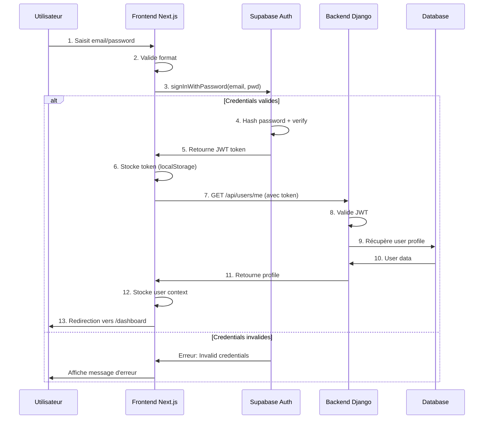

### DS-AUTH-002: Inscription Commerçant Multi-Étapes

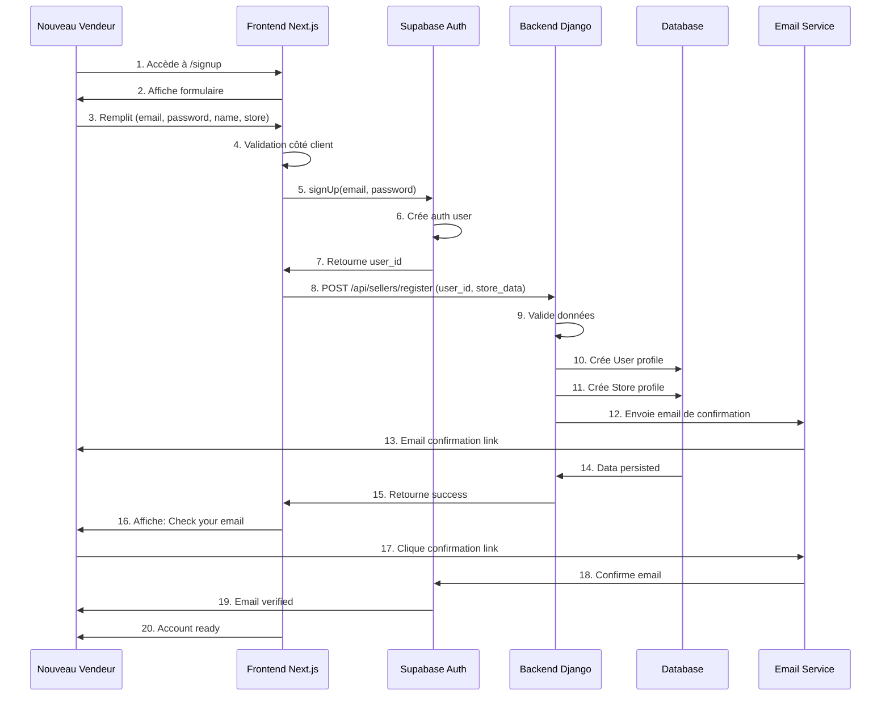

---

## 🛒 Domaine 2: Commandes E-Commerce

### DS-ORDER-001: Flux Complet d'une Commande (Happy Path)

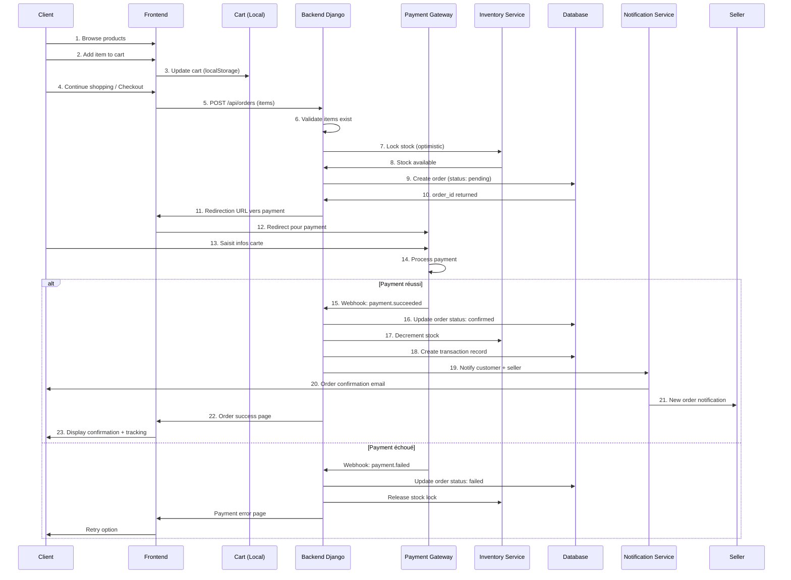

### DS-ORDER-002: Gestion des Erreurs de Paiement

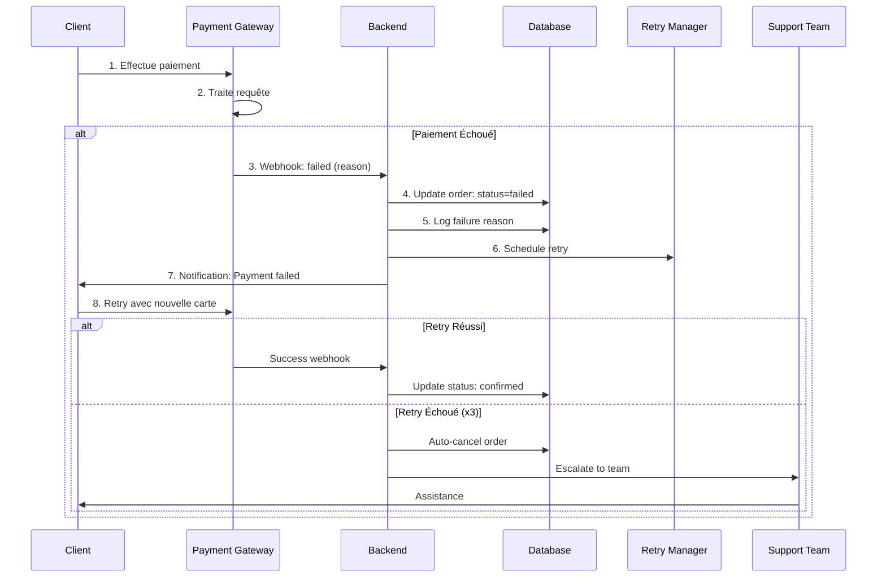

### DS-ORDER-003: Suivi en Temps Réel avec Websockets

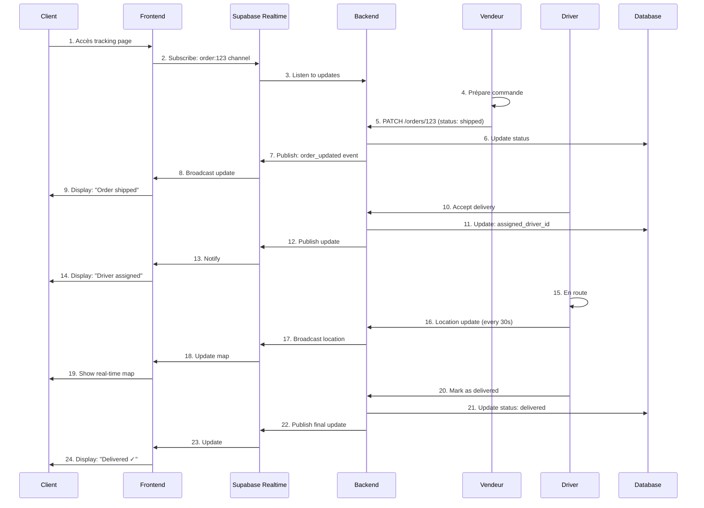

---

## 💳 Domaine 3: Paiement et Finances

### DS-PAYMENT-001: Paiement Sécurisé avec Tokenization

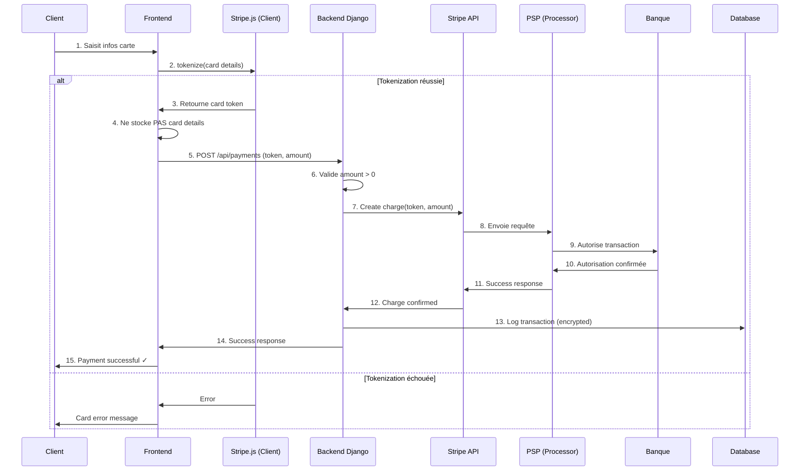

### DS-PAYMENT-003: Payout aux Vendeurs (Async Job)

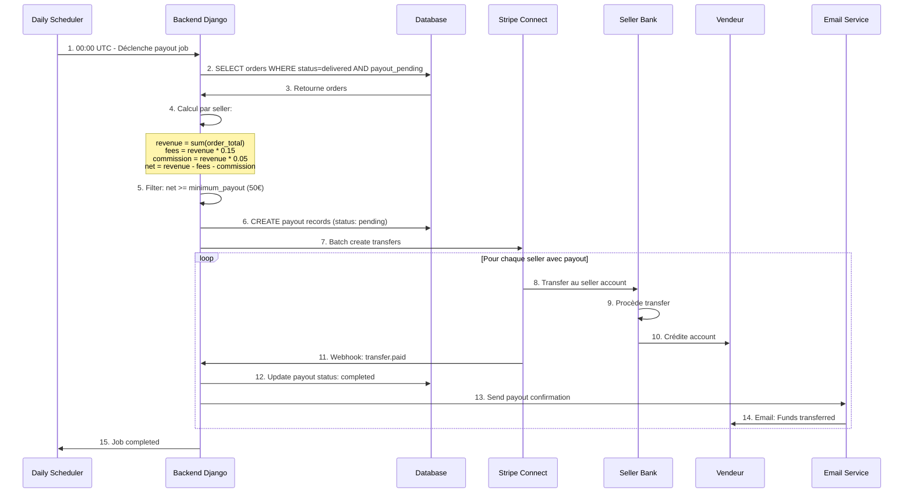

---

## 📅 Domaine 4: Booking de Services

### DS-BOOKING-001: Réservation Service avec Calendly

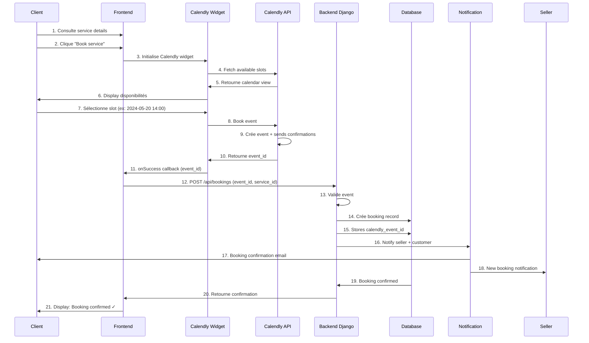

---

## 🚚 Domaine 5: Livraison et Géolocalisation

### DS-DELIVERY-001: Assignment Automatique d'un Driver

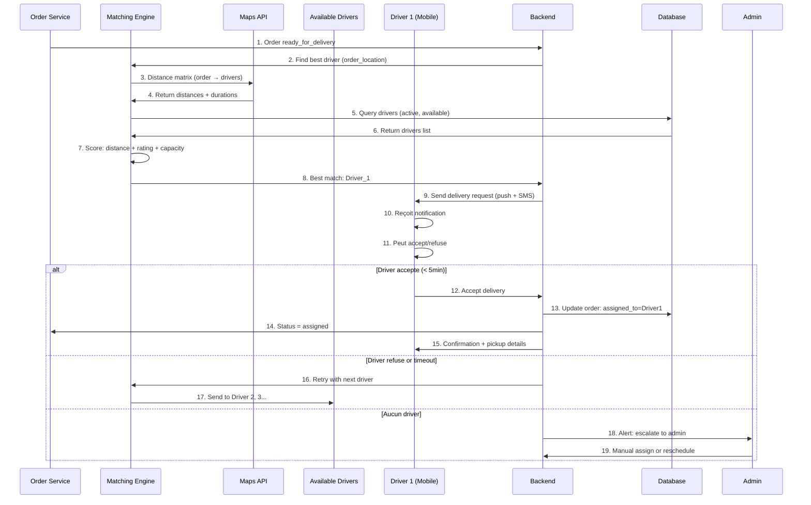

### DS-DELIVERY-002: Suivi en Temps Réel avec Géolocalisation

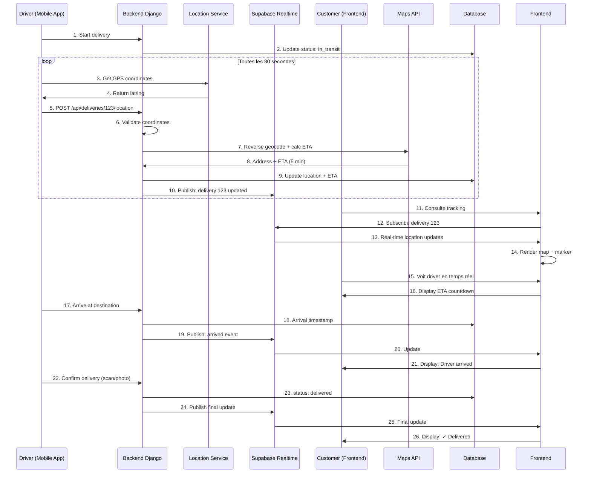

---

## 🛡️ Domaine 6: Détection de Fraude

### DS-FRAUD-001: Détection en Temps Réel

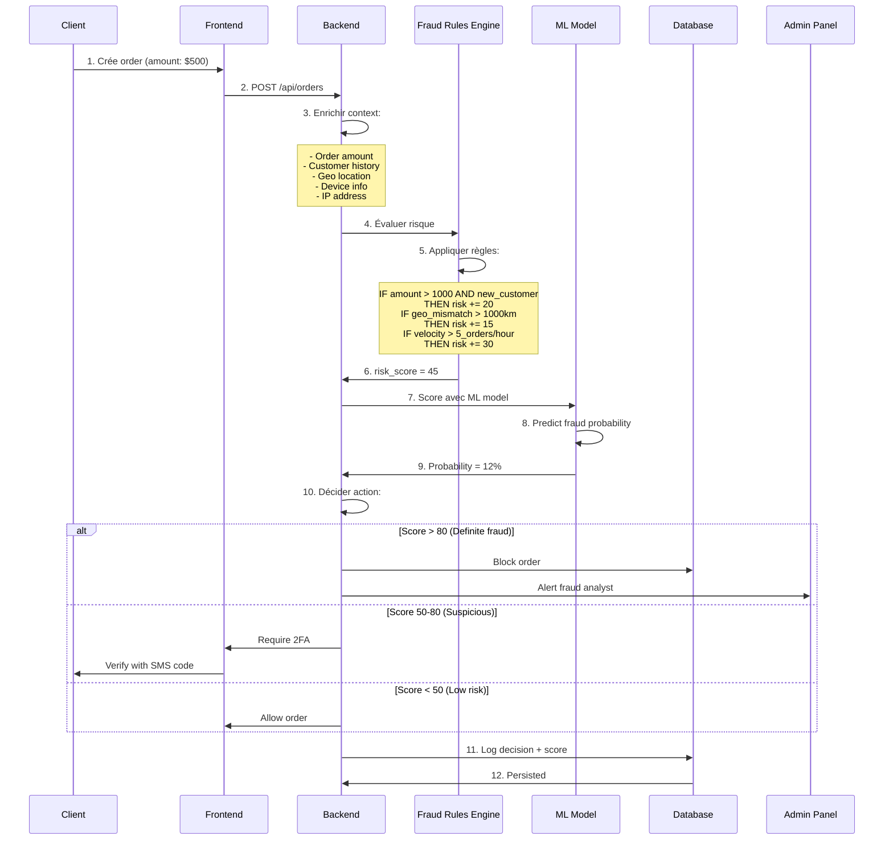

---

## ⭐ Domaine 7: Avis et Évaluations

### DS-REVIEW-001: Publication et Modération d'Avis

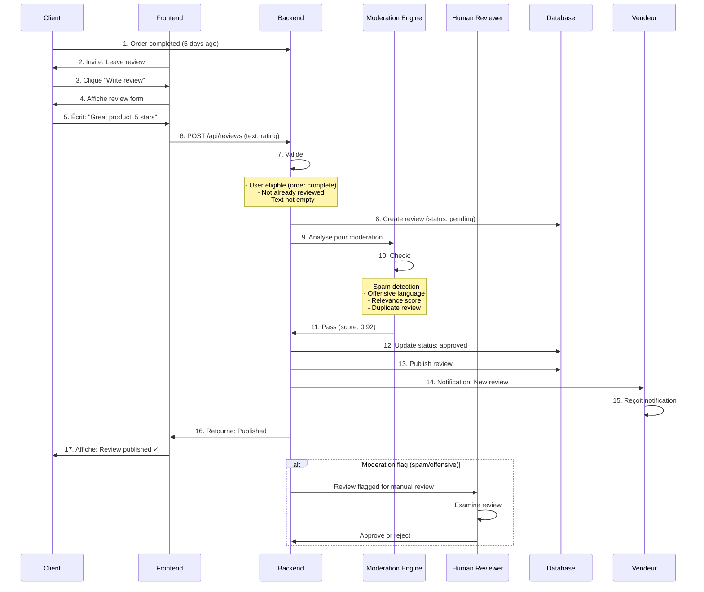

---

## 📊 Domaine 8: Analytics et Reporting

### DS-ANALYTICS-001: Dashboard Vendeur (Cached)

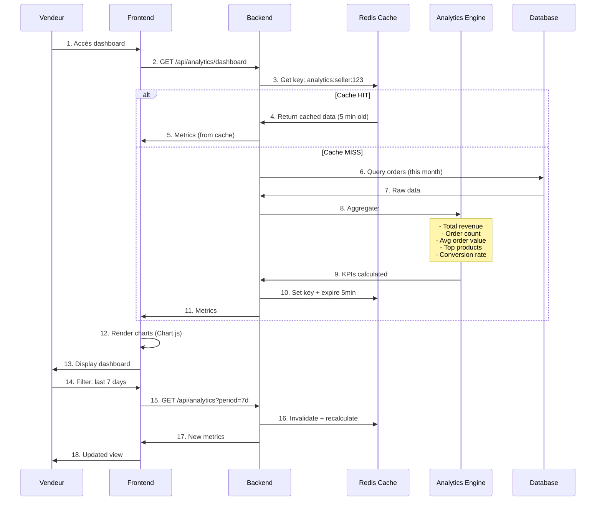

---

## 🔗 Domaine 9: Intégrations Externes

### DS-INTEGRATION-001: Supabase Realtime Pub/Sub

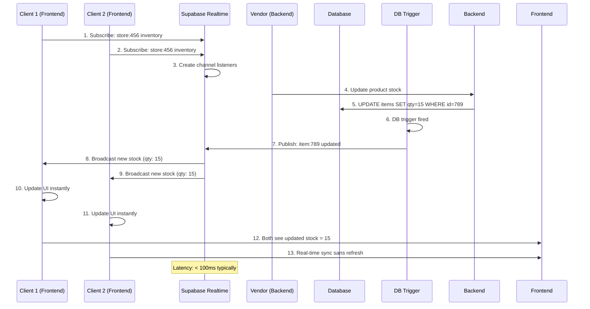

---

## 📝 Notes pour le Rapport

### Conseils de Présentation

1. **Couleurs et Styling**:
   - Utiliser couleurs cohérentes pour acteurs (Bleu: Frontend, Vert: Backend, Rouge: External)
   - Gras pour actions critiques

2. **Niveau de Détail**:
   - Pour PFE: 8-15 étapes par diagramme
   - Inclure cas d'erreur pour complexité
   - Montrer où la base de données est utilisée

3. **Descriptions**:
   - Ajouter objectif pédagogique avant chaque diagramme
   - Lister acteurs participants
   - Énumérer technos utilisées

4. **Organisation**:
   - Regrouper par domaine fonctionnel
   - Progresser de simple à complexe
   - Core flows en premier (Auth, Order, Payment)

5. **Validation**:
   - Tester chaque diagramme Mermaid (syntax correct)
   - Vérifier pas d'acteurs oubliés
   - Confirmer flux logique

---

**Generated**: 15 Mai 2026  
**Format**: Mermaid Sequence Diagrams  
**Target**: PFE Report
